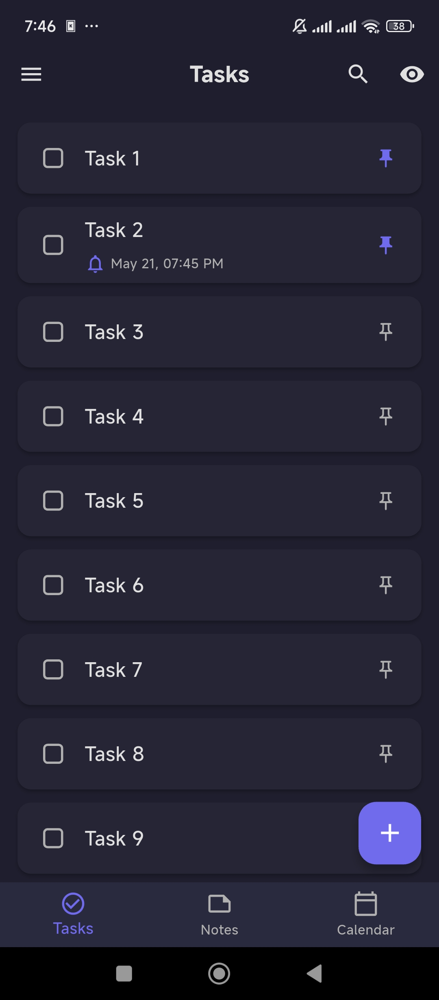
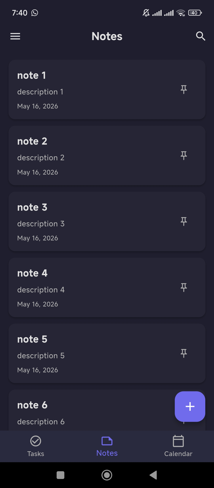
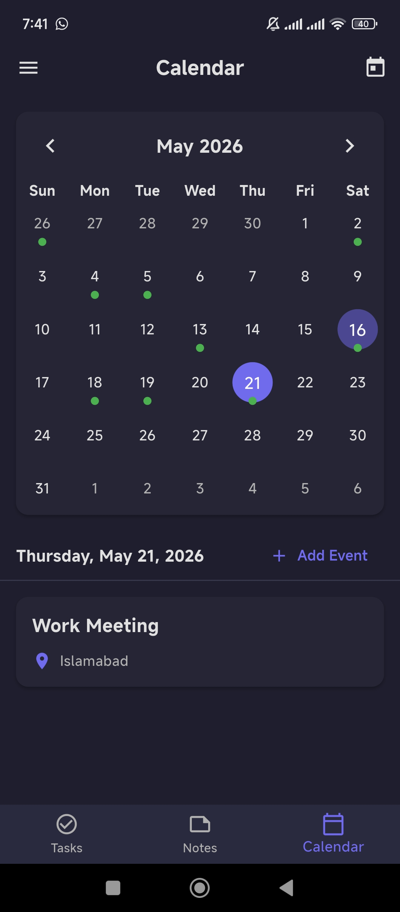
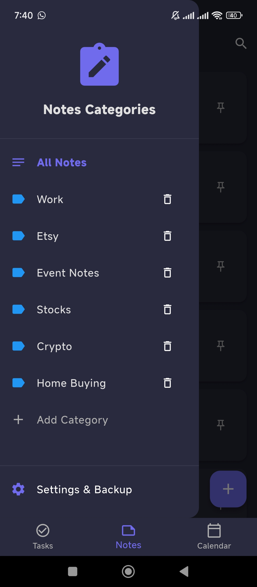
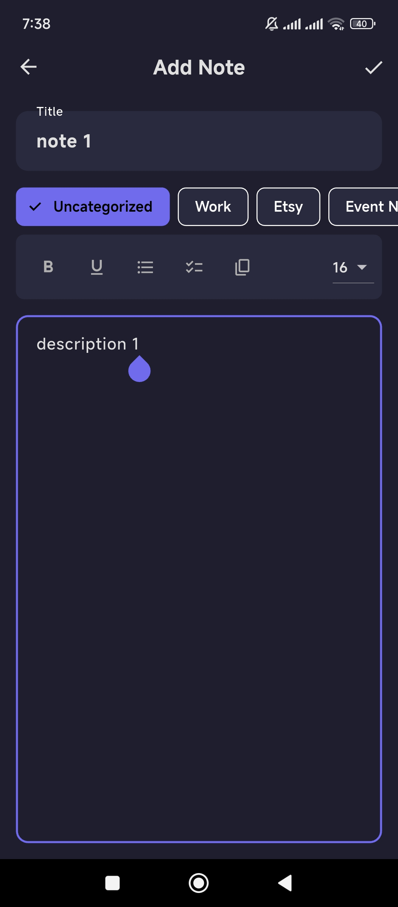
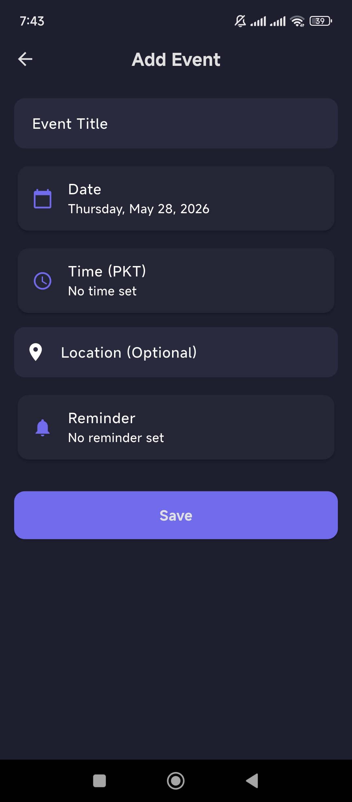
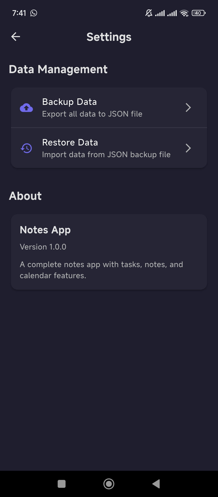
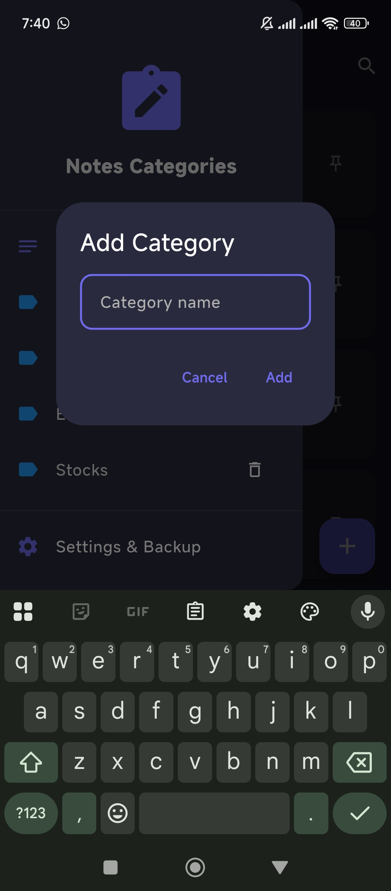

# Notes App — Tasks, Notes & Calendar

A modern, elegant, and fully-featured productivity suite built with **Flutter**. Notes App provides a seamless experience for managing tasks, notes, and calendar events with a focus on clean code, responsive UI, and robust data management.

---

## 📱 App Screenshots Preview

<div align="center">
  <h3>Core Modules</h3>
  
  
  
</div>

<br/>

<div align="center">
  <h3>Notes & Events Management</h3>
  
  
  
</div>

<br/>

<div align="center">
  <h3>Settings & Customization</h3>
  
  
</div>

---

## ✨ Key Features

### 📋 Task Management
* **Interactive To-Dos:** Add, edit, delete, and reorder tasks with ease.
* **Smart Reminders:** Set specific reminders for high-priority items to stay on track.
* **Visual Progress:** Mark tasks as complete with visual strikethrough.
* **Fluid UI:** Enjoy interactive, swipeable cards for a fast and efficient workflow.

### 📝 Rich Notes with Categories
* **Powerful Rich Text Editor:** Powered by **Flutter Quill** for in-app formatting including Bold, Underline, and dynamic Font Sizes.
* **Checklists Support:** Integrated checkbox support for list-making and step-by-step tasks.
* **Organization:** Organize notes into custom categories with dedicated color coding.
* **Smart Focus:** Automatic keyboard dismiss management when tapping outside inputs.

### 📅 Advanced Calendar
* **Monthly Overview:** Built with **Table Calendar** for a smooth and intuitive monthly view.
* **Event Management:** Add events with specific Time, Location, and Reminder triggers.
* **Timezone Optimized:** Full support for PKT (Pakistan Time) with a clean, dark-themed time picker.
* **Gesture Navigation:** Swipe gestures to effortlessly navigate between months.

### 💾 Data Security & Portability
* **Ultra-Fast Local Storage:** Powered by **Hive** NoSQL database for instant offline access and reliability.
* **Custom Export/Backup:** Backup all your data to a JSON file and choose your preferred save location.
* **Seamless Restore:** Easily select a JSON backup from your file manager to migrate or recover your data.

### 🎨 Design & Experience
* **Professional Dark Theme:** Beautiful, spacious, and clutter-free interface designed for deep focus.
* **Fully Responsive:** No hardcoded sizes! All UI elements scale dynamically using global media query variables.
* **Ripple-Free Navigation:** Seamless transitions via a clean Bottom Navigation Bar.

---

## 🛠️ Architecture & Tech Stack

Notes App follows the **MVVM (Model-View-ViewModel)** pattern combined with **GetX** for dependency injection and state management, ensuring a highly scalable and maintainable codebase.

### Core Tech Stack
* **Framework:** Flutter (Dart)
* **State Management:** `GetX` (Reactive programming & Dependency Injection)
* **Database:** `Hive` & `hive_flutter` (Ultra-fast NoSQL local storage)

### Key Libraries
* **Rich Text Editor:** `flutter_quill`
* **Calendar View:** `table_calendar`
* **Local Notifications:** `flutter_local_notifications`
* **Date & Time:** `intl` & `timezone`
* **UI Utilities:** `reorderables` (for drag-and-drop lists)
* **File Operations:** `file_picker`, `path_provider`, `permission_handler`

### Architecture Highlights
* **Clean Architecture:** Strict separation of concerns across `Core`, `Data`, and `Presentation` layers.
* **Responsive Design:** Custom utility for dynamic scaling without hardcoded sizes.

---

## 🚀 Getting Started

### Prerequisites
* Flutter SDK
* Dart SDK
* An Android/iOS Emulator or Physical Device

### Installation

1. **Clone the repository:**
   ```bash
   git clone https://github.com/5-abdulsami/notes_app.git
   cd notes_app

```

2. **Install dependencies:**
```bash
flutter pub get

```


3. **Generate Hive TypeAdapters:**
```bash
flutter pub run build_runner build --delete-conflicting-outputs

```


4. **Run the app:**
```bash
flutter run

```


---

## 🗂 Project Structure

```text
lib/
├── core/
│   ├── theme/          # AppTheme colors and styles
│   └── utils/          # Responsive helper & global variables
├── data/
│   ├── models/         # Task, Note, and Event data models
│   └── services/       # Storage and Backup services
└── presentation/
    ├── controllers/    # GetX Controllers (Logic)
    ├── screens/        # UI Screens (Tasks, Notes, Calendar, Home)
    └── widgets/        # Reusable UI components

```

---

## 📝 License

This project is licensed under the MIT License.

## 👤 Author

**Abdul Sami**

* Organize your life, your way.
* Enjoy using **Notes App**!

---
